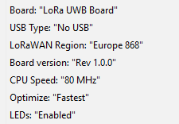
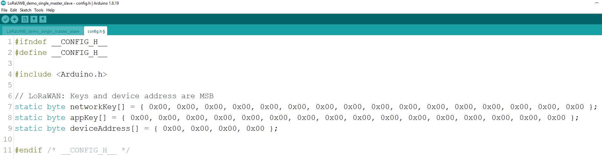
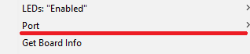
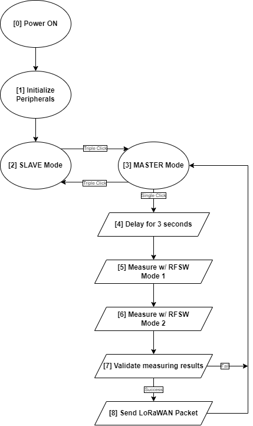
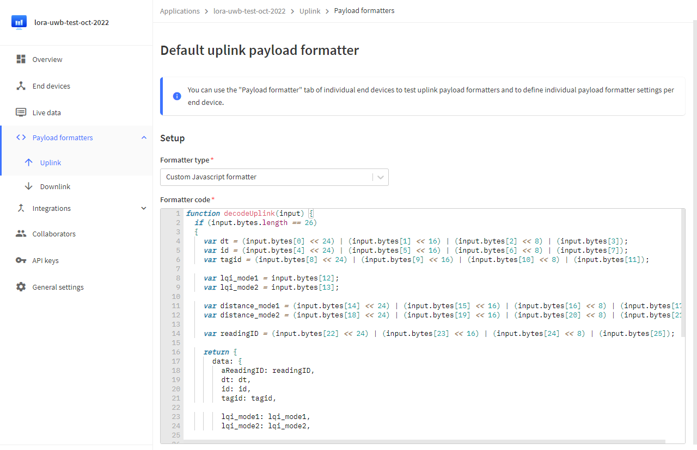
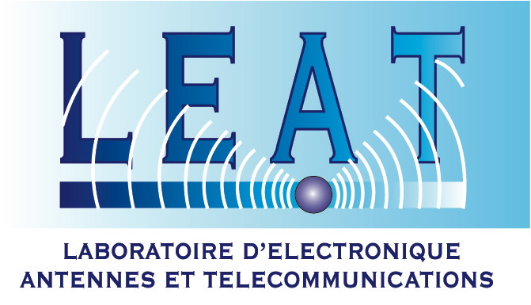

# LoRaUWB_demo_single_master_slave

This Arduino sketch operates the LoRa-UWB Board (UCA - LEAT) in Master & Slave modes for Ultra-wideband measurement senarios. The measurement results including distance & link quality betweem the Master and Slave are sent to The Things Network via LoRaWAN Network.

The board starts in Slave Mode by default. To change to Master mode, press UserButton 3 times (triple click). In Master Mode, press UserButton 1 time (single click) to trigger the measurement. Measurement result will be send to LoRaWAN network.

 <i>Contact project leaders in [Credits]() section below for further details of the project, the hardware/antenna design & the measurement results.</i> 

# Requirements

* [Arduino IDE](https://www.arduino.cc/en/software)
* [nguyenmanhthao996tn/LoRa-UWB-Core](https://github.com/nguyenmanhthao996tn/LoRa-UWB-Core)

<i><b>Arduino Legacy IDE (1.8.X) is recommended. Both LoRa-UWB-Core & this sketch are not tested on Arduino IDE version >= 2.0.</b></i>

# Setup / Getting Started

1. <b>Setup [Arduino IDE](https://www.arduino.cc/en/software) & [LoRa-UWB-Core](https://github.com/nguyenmanhthao996tn/LoRa-UWB-Core)</b>

Follow instructions on LoRa-UWB-Core's Github.

2. <b>Config Board options</b>

Open ArduinoIDE, configure the board options (Tool Menu) as the following image:

3. <b>Open <i><u>LoRaUWB_demo_single_master_slave.ino</u></i> sketch</b>

Change <i>networkKey</i>, <i>appKey</i> & <i>deviceAddress</i> according to your device information on The Things Network.

Consult this [Guide from The Things Industack](https://www.thethingsindustries.com/docs/devices/adding-devices/) if you haven't registrate your device.

4. <b>Plug your LoRa-UWB Board to your PC via USB</b>

5. <b>Compile & Upload the sketch</b>

<i>Remember to choose the right COM Port that connect to your LoRa-UWB Board</i>

If the COM Port of the LoRa-UWB Board does NOT show up in the list, the USB Type may be set as No USB in the previous upload. In this case, trigger the Bootloader Mode of the LoRa-UWB Board to uploader the code by holding BOOT button and press RESET Button.

Ensure that there is NO COM Port selected in Tool Menu (unless it will be failed to upload).

# Program States Diagram

## [0] Power ON

The initial state after power ON or reset.

## [1] Initialize Peripherals

This state initializes Serial (if available), LEDs, User button, LoRa Module, UWB Module, RF Switch. LEDs behaviours <b>1</b> is triggered if the initialization is done with no error.

Autimatically move to <b>[2] SLAVE Mode</b> state when finish.

## [2] SLAVE Mode

This state set the UWB Module as <b>Slave</b> then blink the red LED every 5 seconds. LEDs behaviours <b>2</b> is triggered at the begining of this state to indicate that Slave Mode started.

This state is infinitely looped. If a triple click is detected on the User Button, move to <b>[3] MASTER Mode</b> state.

## [3] MASTER Mode

This state set the UWB Module as <b>Master</b>. If a single click is detected on the User Button, a measurement is triggered. LEDs behaviours <b>2</b> is also used indicate that Master Mode started.

This state is infinitely looped.

If a single click is detected on the User Button, move to <b>[4] Delay for 3 seconds</b> state.

If a triple click is detected on the User Button, move to <b>[2] SLAVE Mode</b> state.

## [4] Delay for 3 seconds

In this state, the board is waiting for 3 seconds for being setup in the measuring desired position. This is for avoiding the unnecessary error when measuring. LEDs behaviours <b>4</b> also is triggered.

Automatically move to <b>[5] Measure w/ RFSW Mode 1</b> state when finish.

## [5] Measure w/ RFSW Mode 1

The RF Switch - SKY13438 is set in Mode 1 <i>(Check out the board schematic & [SKY13438 Datasheet](https://www.skyworksinc.com/-/media/DAEC26F50EBB495E8FB9B316A783D3C0.pdf) for details)</i>. The MCU wait 1 seconds for the UWB Signal get stable. Then, the result information including TD, ID, TAG_ID, LQI, DIST is extracted if available.

Automatically move to <b>[6] Measure w/ RFSW Mode 2</b> state when finish.

## [6] Measure w/ RFSW Mode 2

The RF Switch - SKY13438 is set in Mode 2 <i>(Check out the board schematic & [SKY13438 Datasheet](https://www.skyworksinc.com/-/media/DAEC26F50EBB495E8FB9B316A783D3C0.pdf) for details)</i>. The MCU wait 1 seconds for the UWB Signal get stable. Then, the result information including TD, ID, TAG_ID, LQI, DIST is extracted if available.

Automatically move to <b>[7] Validate mersuring results</b> state when finish.

## [7] Validate mersuring results

This state compare the TD, ID, TAG_ID archived in <b>[5] Measure w/ RFSW Mode 1</b> & <b>[6] Measure w/ RFSW Mode 2</b>.

If TD, ID, TAG_ID are identical, trigger LEDs behaviours <b>5</b> then move to <b>[8] Send LoRaWAN Packet</b> state.

If TD, ID, TAG_ID are not the same or result not available, trigger LEDs behaviours <b>6</b> then move to <b>[3] MASTER Mode</b> state.

## [8] Send LoRaWAN Packet

In this state, a LoRaWAN packet is built & sent over LoRaWAN Network as the below format. The <b><i>docs/function_decodeUplink.js</b></i> file can be used as the Uplink Payload Formater on The Things Network's website. 

|    DT   |    ID   |  TAG_ID | LQI Mode 1 | LQI Mode 2 | DIST Mode 1 | DIST Mode 2 | Reading ID |
|:-------:|:-------:|:-------:|:----------:|:----------:|:-----------:|:-----------:|:----------:|
| 4 bytes | 4 bytes | 4 bytes |   1 byte   |   1 byte   |   4 bytes   |   4 bytes   |   4 bytes  |

Automatically move to <b>[3] MASTER Mode</b> state when finish.

# LEDs behaviours
There are 2 LEDs on the LoRa-UWB Board: 1x <b>Red LED</b> & 1x <b>Blue LED</b>.

1. <b><b>Blue LED</b> blinks 2 times -> <b>Red LED</b> blinks 2 times -> <b>Blue LED</b> blinks 2 times -> <b>Red LED</b> blinks 2 times</b>: The initialization is done without error.

2. <b><b>Red LED</b> blinks 2 times -> <b>Red LED</b> is ON for 0.5 second</b>: The Slave Mode started.

3. <b><b>Blue LED</b> blinks 2 times -> <b>Blue LED</b> is ON for 0.5 second</b>: The Master Mode started.

4. <b><b>Blue LED</b> is ON for 1 second</b>: The Master Mode Measurement is started. You have 3 seconds (including 1 second of <b>Blue LED</b> ON) to put the board in the position.

5. <b><b>Blue LED</b> blinks 5 times</b>: The Master Mode Measurement is done.

6. <b><b>Red LED</b> blinks 5 times</b>: The Master Mode Measurement is failed.

# USER Button behaviours

## Single Click

In Master Mode, it triggers a measurement. The result will be sent to LoRaWAN network (TTN) if it's available.

In Slave Mode, it do nothing.

## Double Click

<i>(No more than 400 milliseconds between 2 clicks)</i>

Do nothing.

## Triple Click

<i>(No more than 400 milliseconds between 2 clicks)</i>

Switch between Master Mode & Slave Mode.

# Credits
This project is led by [<b>Amnia Benouakta</b>](mailto:Amina.Benouakta@unice.fr ) & [Prof. <b>Fabien Ferrero</b>](https://github.com/FabienFerrero) at <b>LEAT. Laboratoire d'Electronique, Antennes et Télécommunications. Université Cote d'Azur, CNRS UMR 7248.</b>

###### <i>Source code maintained by <b>mtnguyen</b>.</i>
